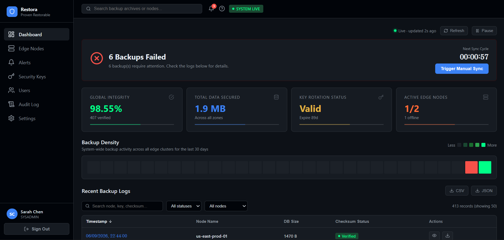
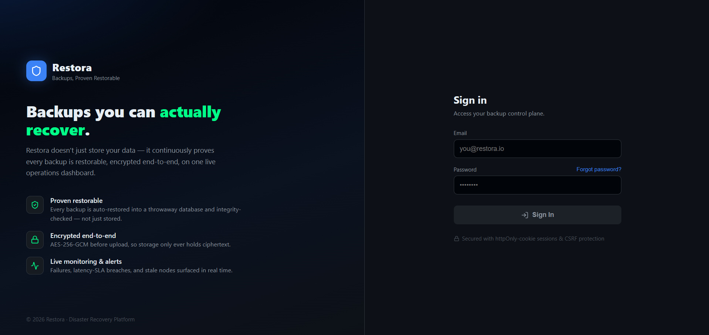
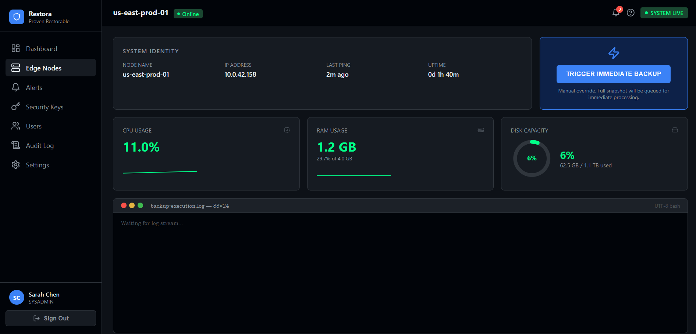
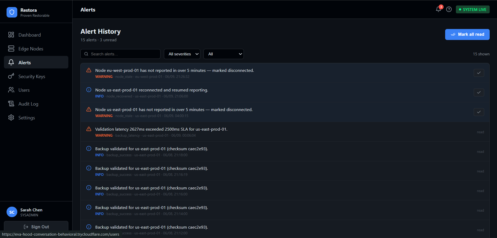
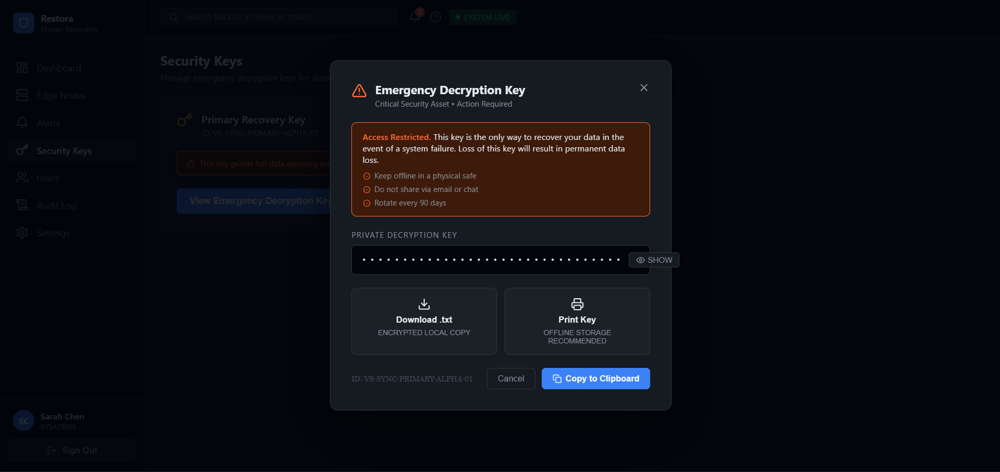

<div align="center">

# 🛡️ Restora

### Disaster-recovery platform that doesn't just back up your data — it *proves* every backup can actually be restored.

[](#tech-stack)
[](#tech-stack)
[](#tech-stack)
[](#quick-start-run-it-locally-in-one-command)
[](#tech-stack)
[](#tested--ci)
[](.github/workflows/ci.yml)

</div>

---

## The problem

Almost every company backs up its data. Almost none **verify those backups actually restore**.
The corruption, the half-written dump, the wrong encryption key — you discover it during a real
disaster, when it's already too late. A backup you've never tested is a fire extinguisher you've
never checked.

## What Restora does

Restora continuously backs up databases, encrypts them end-to-end, and — the part that matters —
**performs an automated test-restore of every single backup**: it spins up a throwaway database,
loads the backup into it, fingerprints the actual contents to detect any corruption, and tears it
down. You get *evidence* you can recover, not hope. Everything is surfaced on a live operations
dashboard with auth, alerts, and an audit trail.

<div align="center">
  
  <br>
  <em>Operations dashboard — integrity KPIs, backup-density heatmap, live backup logs, and alerting that catches failures.</em>
</div>

---

## How it works

```
 source DB ──► edge daemon (Go) ───────────► S3 ──(event)──► SQS ──► validator (Node/TS)
 (your data)   pg_dump → gzip →              encrypted        │       ├─ decrypt → gunzip
               AES-256-GCM encrypt →          object          │       ├─ import into ephemeral PG
               spool → upload                                 │       ├─ content-hash integrity check
                                                              │       └─ drop ephemeral DB
                                                              ▼
 control panel (React) ◄── API (Express) ◄──────────── telemetry DB (Postgres)
   dashboard / RBAC          JWT cookie auth, RBAC, alerts,
                             audit log, key rotation, retention, SES email
```

1. **Edge daemon (Go)** dumps the source DB, **gzips** it (~77% smaller), **AES-256-GCM encrypts**
   it with a key from Secrets Manager, and uploads to S3. *Encryption happens before upload — storage
   only ever holds ciphertext.*
2. An **S3 → SQS** event wakes the **validator**, which decrypts in memory, imports the dump into an
   **ephemeral Postgres**, runs a **content-hash integrity check** (per-row hashes combined
   order-independently, so a single changed row is caught), records the result, and drops the scratch DB.
3. The **API** serves that telemetry to a **React dashboard** with cookie-based auth, RBAC, alerts,
   an audit trail, key rotation, and retention controls.

---

## Screenshots

<div align="center">
  <br>
  <em>Branded sign-in — httpOnly-cookie sessions with CSRF protection.</em>
</div>

<br>

<table>
  <tr>
    <td width="50%" valign="top">
      <br>
      <strong>Edge node detail.</strong> Live CPU / RAM / disk metrics, a streaming
      backup-execution log, and a manual "trigger immediate backup" override.
    </td>
    <td width="50%" valign="top">
      <br>
      <strong>Alert history.</strong> Failure / latency-SLA / stale-node alerts with
      severity + status filtering and acknowledgement.
    </td>
  </tr>
  <tr>
    <td width="50%" valign="top">
      <br>
      <strong>Emergency decryption key.</strong> RBAC-gated reveal / download / print
      of the recovery key, with explicit offline-storage and rotation guidance.
    </td>
    <td width="50%" valign="top">
      <br>
      <strong>Audit log.</strong> A timestamped trail of every privileged action —
      actor, action, target, and detail — for compliance and forensics.
    </td>
  </tr>
</table>

---

## Highlights worth a look

- **Validated backups** — restorability is *proven* every run, not assumed. The integrity check hashes
  real table content, so corruption is genuinely detectable (verified by tests).
- **Real security, done properly** — auth token in an **httpOnly cookie + CSRF double-submit** (not
  `localStorage`), **RBAC** (`SysAdmin` / `BusinessOwner` / `ReadOnly`), bcrypt hashes, helmet headers,
  rate-limited login lockout, **AES-256-GCM** with **key rotation** via Secrets Manager, and a
  **fail-closed** config guard that refuses to boot in production with default secrets.
- **Operational maturity** — DB-backed **alerts** (failure / latency-SLA / stale-node), **audit log** of
  every privileged action, **SES email** notifications, configurable **S3 retention lifecycle**,
  `/health` + `/ready` probes, structured access logs, and graceful SIGTERM shutdown.
- **Genuinely distributed** — a Go agent, a message queue, a Lambda-compatible TS validator, and a React
  control plane — event-driven and decoupled, not a CRUD monolith.

---

## Tech stack

| Layer | Tech |
|-------|------|
| Edge daemon | **Go** — aws-sdk-go-v2, robfig/cron, `/proc` + statfs metrics |
| Validator + API | **Node.js / TypeScript** — Express, pg, AWS SDK v3 (validator is Lambda-portable) |
| Dashboard | **React 18 + Vite + TypeScript** — react-router, recharts, lucide |
| Cloud (local) | **Docker Compose + LocalStack** — S3 / SQS / Secrets Manager / SES, $0 and no AWS account |
| Cloud (prod) | **Terraform** → real AWS — S3 / SQS+DLQ / Secrets / SES / RDS / least-privilege IAM |
| CI | **GitHub Actions** — typecheck + test + build every service, then docker build |

---

## Quick start (run it locally in one command)

> Requires Docker. No AWS account needed — LocalStack mocks the cloud.

```bash
cd vaultsync
docker compose up --build
```

Open **http://localhost:5173** and sign in:

| Role | Login |
|------|-------|
| SysAdmin | `admin@restora.io` / `RestoraAdmin!2026` |
| BusinessOwner | `owner@restora.io` / `RestoraOwner!2026` |
| ReadOnly | `viewer@restora.io` / `RestoraViewer!2026` |

The stack provisions itself (bucket / queue / secret / SES) and starts taking backups every 2 minutes.
Watch them reach **PASS** in the dashboard.

---

## Tested & CI

```bash
cd vaultsync/cloud-engine/api        && npm test   # auth / RBAC (jest)
cd vaultsync/cloud-engine/validator  && npm test   # crypto round-trip (jest)
cd vaultsync/control-panel           && npm test   # format / cron (vitest)
```

**26 unit tests**; CI ([`.github/workflows/ci.yml`](.github/workflows/ci.yml)) typechecks, tests, and
builds every package on push/PR.

---

## Deploy

- **Free, single-VM showcase (HTTPS):** [`vaultsync/docs/DEPLOY-FREE.md`](vaultsync/docs/DEPLOY-FREE.md) —
  Caddy auto-TLS + a free subdomain, the whole stack on one always-free VM.
- **Real AWS:** [`vaultsync/docs/DEPLOY.md`](vaultsync/docs/DEPLOY.md) — Terraform → ECR → env mapping →
  schema init → TLS at the ALB → smoke test → DR drill.
- **Operations / DR drill:** [`vaultsync/docs/RUNBOOK.md`](vaultsync/docs/RUNBOOK.md).

---

## Project layout

```
vaultsync/
├── edge-node/            Go backup daemon
├── cloud-engine/
│   ├── api/              Express API (auth, RBAC, alerts, audit, settings…)
│   └── validator/        SQS worker: decrypt → validate → telemetry
├── control-panel/        React dashboard
├── infra/
│   ├── db/               telemetry schema + source seed
│   ├── localstack/       local AWS bootstrap
│   └── terraform/        real-AWS IaC
└── docs/                 deploy + runbook + free-deploy guides
```

📖 Full technical README: [`vaultsync/README.md`](vaultsync/README.md)

---

<div align="center">
<sub>Built as a full end-to-end systems project — Go · TypeScript · React · Docker · Terraform · AWS.</sub>
</div>
